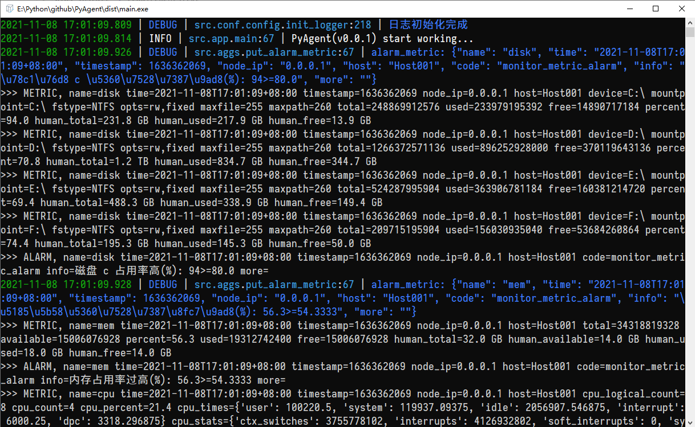
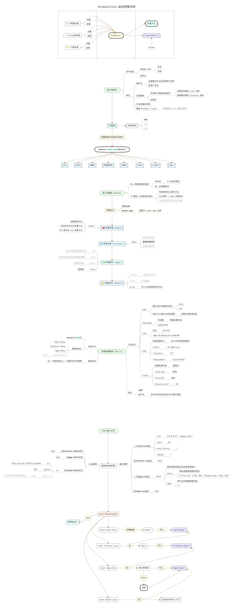

# PyAgent (运维监控和指标采集客户端框架)

## 功能

基于 asyncio 的高性能/插件式 Python Agent, 跨平台的运维监控和指标采集框架. 兼容 Windows/Linux, 灵感来自于: `Telegraf`

- 配置动态加载
- 插件式, 易扩展, 插件自动扫描/静态注册(默认)
- 轻量协程, 资源占用低, 若有阻塞类代码请放入线程执行
- 脚手架, 请根据业务需要编写插件即可
  - 基础插件: `demo`, `cpu`, `mem`, `disk`, `curl`, `network`, `ping`, `telnet`

## 依赖

兼容 `Python-3.8.5+`, 依赖见: [requirements.txt](requirements.txt)

## 使用

直接源码运行:

```shell
pip3 install -r requirements.txt
python3 main.py
# nohup ./main.py >./log/run.log 2>&1 &
```

```shell
root@DevBeta:~/py/pyagent# python3 main.py 
2021-11-08 16:58:55.535 | DEBUG | src.conf.config.init_logger:218 | 日志初始化完成
2021-11-08 16:58:55.536 | INFO | src.app.main:67 | PyAgent(v0.0.1) start working...
>>> METRIC, name=disk time=2021-11-08T16:58:55+08:00 timestamp=1636361935 node_ip=0.0.0.1 host=Host001 device=/dev/sda2 mountpoint=/ fstype=ext4 opts=rw,relatime maxfile=255 maxpath=4096 total=42004086784 used=22700482560 free=17139503104 percent=57.0 human_total=39.1 GB human_used=21.1 GB human_free=16.0 GB
>>> METRIC, name=mem time=2021-11-08T16:58:55+08:00 timestamp=1636361935 node_ip=0.0.0.1 host=Host001 total=8348397568 available=5583859712 percent=33.1 used=2405683200 free=755449856 active=3767451648 inactive=3022487552 buffers=662564864 cached=4524699648 shared=46055424 slab=650911744 human_total=7.8 GB human_available=5.2 GB human_used=2.2 GB human_free=720.5 MB human_active=3.5 GB human_inactive=2.8 GB human_buffers=631.9 MB human_cached=4.2 GB human_shared=43.9 MB human_slab=620.8 MB
>>> METRIC, name=telnet time=2021-11-08T16:58:55+08:00 timestamp=1636361935 node_ip=0.0.0.1 host=Host001 tag=迅游网站 HTTPS 测试 address=xunyou.com:443 as_ipv6=False timeout=5 yes=True n=0
>>> METRIC, name=telnet time=2021-11-08T16:58:55+08:00 timestamp=1636361935 node_ip=0.0.0.1 host=Host001 tag=百度80端口(IPv4) address=baidu.com:80 as_ipv6=False timeout=6 yes=True n=0
>>> METRIC, name=cpu time=2021-11-08T16:58:55+08:00 timestamp=1636361935 node_ip=0.0.0.1 host=Host001 cpu_logical_count=4 cpu_count=4 cpu_percent=2.5 cpu_times={'user': 1741209.93, 'nice': 4052.77, 'system': 422872.23, 'idle': 60109483.72, 'iowait': 3555.77, 'irq': 0.0, 'softirq': 95267.22, 'steal': 0.0, 'guest': 0.0, 'guest_nice': 0.0} cpu_stats={'ctx_switches': 16577901662, 'interrupts': 13940036467, 'soft_interrupts': 17687347457, 'syscalls': 0} cpu_freq={'current': 3300.0, 'min': 0.0, 'max': 0.0}
>>> METRIC, name=ping time=2021-11-08T16:58:59+08:00 timestamp=1636361939 node_ip=0.0.0.1 host=Host001 loss=0.0 minimum=35.373 maximum=41.993 average=37.653 tag=114DNS address=114.114.114.114
>>> METRIC, name=ping time=2021-11-08T16:58:59+08:00 timestamp=1636361939 node_ip=0.0.0.1 host=Host001 loss=0.0 minimum=31.529 maximum=74.759 average=41.084 tag=阿里IPv6DNS address=2400:3200::1
>>> METRIC, name=ping time=2021-11-08T16:59:04+08:00 timestamp=1636361944 node_ip=0.0.0.1 host=Host001 loss=0.0 minimum=195.219 maximum=308.121 average=204.975 tag=荷兰弗莱福兰 address=91.243.80.33
>>> METRIC, name=ping time=2021-11-08T16:59:07+08:00 timestamp=1636361947 node_ip=0.0.0.1 host=Host001 loss=3.0 minimum=278.272 maximum=370.513 average=283.397 tag=乌克兰苏梅 address=95.47.163.1
>>> METRIC, name=ping time=2021-11-08T16:59:08+08:00 timestamp=1636361948 node_ip=0.0.0.1 host=Host001 loss=43.0 minimum=35.35 maximum=47.399 average=42.876 tag=谷歌DNS address=8.8.8.8
2021-11-08 16:59:19.546 | DEBUG | src.aggs.put_alarm_metric:67 | alarm_metric: {"name": "ping", "time": "2021-11-08T16:59:19+08:00", "timestamp": 1636361959, "node_ip": "0.0.0.1", "host": "Host001", "code": "monitor_metric_alarm", "info": "\u6d4b\u8bd5\u7f51\u7edc\u4e0d\u901a \u4e22\u5305\u6bd4\u4f8b\u8fc7\u9ad8(%): 100>=100.0", "more": "123.0.0.45"}
>>> METRIC, name=ping time=2021-11-08T16:59:19+08:00 timestamp=1636361959 node_ip=0.0.0.1 host=Host001 loss=100 minimum=5000 maximum=5000 average=5000 tag=测试网络不通 address=123.0.0.45
>>> ALARM, name=ping time=2021-11-08T16:59:19+08:00 timestamp=1636361959 node_ip=0.0.0.1 host=Host001 code=monitor_metric_alarm info=测试网络不通 丢包比例过高(%): 100>=100.0 more=123.0.0.45
```

或用 `pyinstaller` 打包后运行, 配置文件目录 `etc` 与 `main.exe` 放在同一目录.

(注: 若要打包请看: `src/conf/config.py` 第 60 行注释, 如果要在 Windows 7 或 2008 上运行, 最好使用 Python-3.8)

`dist` 是单配置文件示例, 解压后运行 `main.exe` 即可.

打包命令参考:

```shell
pyinstaller -p E:\Python\github\PyAgent\venvw\Lib\site-packages -F main.py -i doc\f.ico
```



## 结构

`etc/main.yaml` 必须, 主配置文件, 可以包含所有子配置内容, 也可以将插件配置分别写到下面的目录(优先使用).

```
.
├── doc               设计文档
├── etc               配置文件目录
│   ├── aggs          数据聚合(报警)插件的配置项
│   ├── input         输入(数据采集)插件的配置项
│   ├── output        输出插件的配置项
│   └── processor     数据处理插件的配置项
├── log               日志文件
├── src               代码
│   ├── aggs          插件: 数据聚合(报警)
│   ├── common        公共插件
│   ├── conf          配置处理
│   ├── input         插件: 输入
│   ├── libs          公共类库
│   ├── output        插件: 输出
│   ├── processor     插件: 数据处理
│   └── test          单元测试
└── venvw
```

## 设计



## TODO

- [ ] 配置远程管理
- [ ] 插件动态加载


*ff*